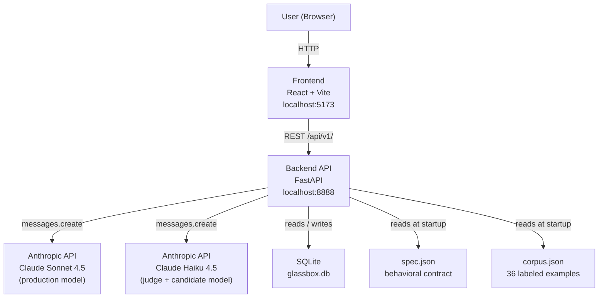
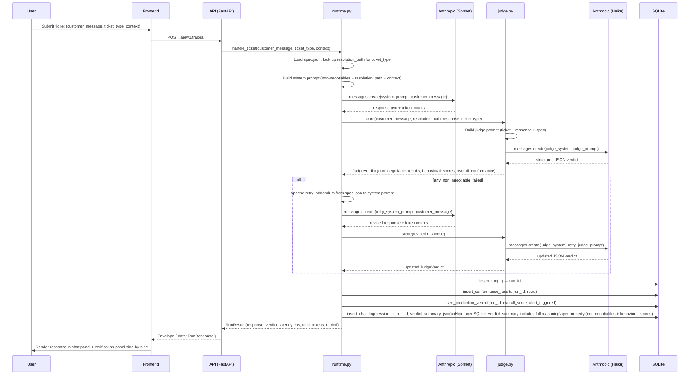
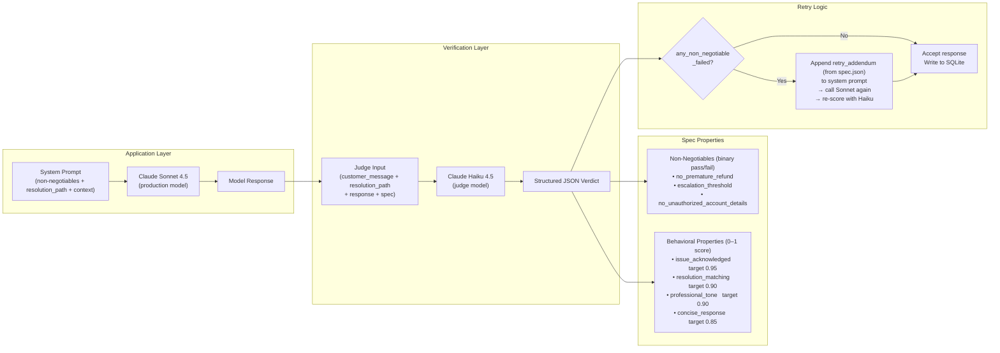
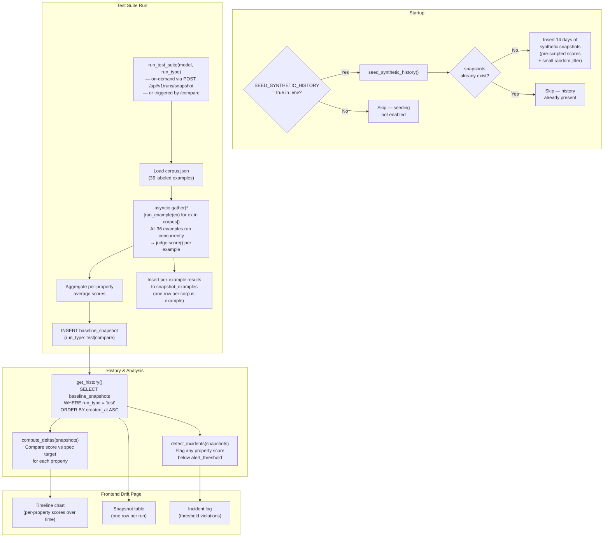
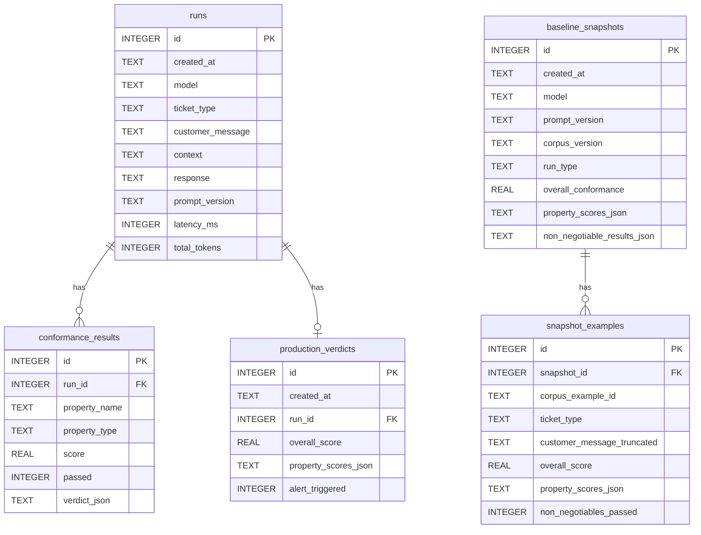
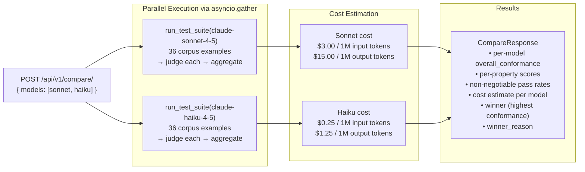

# GlassBox Architecture

> Diagrams rendered with Mermaid — view on GitHub or in a Mermaid-compatible viewer.

---

## 1. System Overview

GlassBox is a full-stack LLM observability application. A React frontend communicates with a FastAPI backend, which drives all LLM calls through the Anthropic SDK and persists every result to a local SQLite database. Two static data files — `spec.json` and `corpus.json` — act as the behavioral contract and test fixture set respectively; the backend reads them at startup.

---

## 2. Request Flow — Live Ticket (Try It page)

This sequence covers the full lifecycle from a user submitting a support ticket on `/try-it` to the frontend rendering the response and verification panel.

---

## 3. Behavioral Verification Loop

The judge operates as an independent scoring layer that is always separate from the production model. It never influences the prompt given to Sonnet — it only evaluates the output after the fact.

---

## 4. Drift Detection Architecture

Drift detection tracks how model conformance changes over time by maintaining a history of test suite snapshots. On first startup, synthetic history is seeded to give the UI something meaningful to display.

---

## 5. Database Schema

**Notes on storage conventions:**

- `conformance_results.property_type` is constrained to `'negotiable'` or `'behavioral'` at the DB level.
- `conformance_results.score` is `NULL` for non-negotiable rows (they are binary pass/fail only).
- `context`, `verdict_json`, `property_scores_json`, and `non_negotiable_results_json` are stored as JSON text and deserialized in the `db.py` layer before being returned to callers.
- `baseline_snapshots` has no direct FK to `runs` — it is an aggregate summary produced by the drift engine, not tied to any individual run.
- `run_type` on `baseline_snapshots` separates data by page: `"baseline"` (Drift page), `"test"` (Test Suite page), `"compare"` (Model Comparison page). `snapshot_examples` stores per-example results with cascade delete tied to the parent snapshot.

---

## 6. Model Comparison Flow

The comparison endpoint runs both models against the full corpus simultaneously using `asyncio.gather`, then produces side-by-side conformance scores and cost estimates.

---

## 7. Frontend Page → API Mapping

| Page | Route | API Endpoints Called |
|---|---|---|
| Home | `/` | None (static splash page) |
| Try It | `/try-it` | `POST /api/v1/traces/` |
| Model Evaluation | `/test-suite` | `GET /api/v1/runs/snapshots?run_type=test`, `POST /api/v1/runs/snapshot` |
| Baseline & Drift | `/drift` | `GET /api/v1/runs/snapshots?run_type=test`, `GET /api/v1/spec`, `PATCH /api/v1/spec/thresholds`, `GET /api/v1/runs/incidents` |
| Model Comparison | `/compare` | `GET /api/v1/runs/snapshots?run_type=compare`, `POST /api/v1/compare/` |
| Production Monitor | `/monitor` | `GET /api/v1/monitor/status`, `GET /api/v1/monitor/verdicts`, `GET /api/v1/monitor/alerts` |
| Chat Log Analytics | `/chatlogs` | `GET /api/v1/chatlogs/analytics`, `GET /api/v1/chatlogs/?session_id=&ticket_type=` |
| Traces (internal) | n/a | `GET /api/v1/traces/`, `GET /api/v1/traces/{run_id}` |

**Per-example detail:** `GET /api/v1/runs/snapshots/{id}/examples` returns the 36 per-example results for any snapshot. `GET /api/v1/runs/snapshots/{id}/diff` returns changed examples between a snapshot and its predecessor — used by the Drift page when a snapshot point is selected.

**Baseline & Drift** no longer has its own "Run Now" button. All test runs are triggered from the Model Evaluation page (`POST /api/v1/runs/snapshot`) and stored with `run_type=test`. The Drift page reads those same snapshots and computes deltas against spec-defined targets (not a historical baseline snapshot). Thresholds are editable in the UI via `PATCH /api/v1/spec/thresholds`, which writes directly to `spec.json`.
