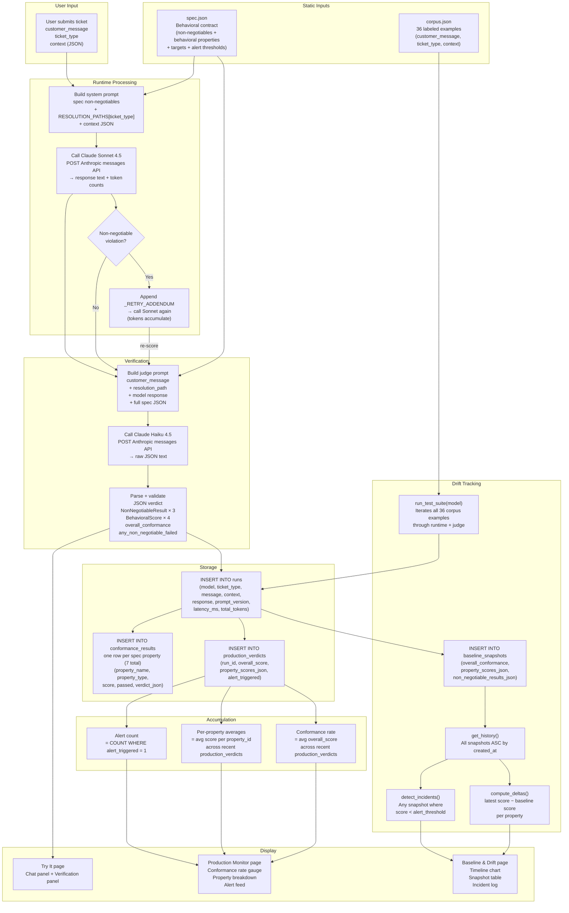

# GlassBox Data Flow

This document traces how data moves through GlassBox from the moment a user submits a ticket to the point where the result is stored and displayed. It also covers how static inputs (spec, corpus) relate to dynamic run data, and how individual verdicts accumulate into the conformance metrics shown across the UI.

---

## Full Data Lifecycle

---

## Static Inputs vs Dynamic Run Data

**`spec.json`** is the behavioral contract. It is read from disk on first use and cached in memory for the lifetime of the process. It defines:

- Which properties to evaluate (names, IDs, descriptions).
- Which are non-negotiables (zero-tolerance, binary) vs behavioral properties (scored 0–1).
- Target scores and alert thresholds for each behavioral property.

`spec.json` shapes every part of the system: the system prompt sent to Sonnet, the judge prompt sent to Haiku, and the alert logic that sets `alert_triggered` on each production verdict.

**`corpus.json`** is the test fixture set — 36 labeled customer support scenarios. It is only read when a test suite run is triggered (drift detection or model comparison). Each example provides `customer_message`, `ticket_type`, and `context`. The corpus is static; it does not grow as new live tickets come in.

**Run data** is fully dynamic. Every ticket submitted via the Try It page (or via a test suite run) creates a row in `runs`, one row per spec property in `conformance_results`, and one row in `production_verdicts`. This data accumulates indefinitely and drives the Monitor and Drift pages.

---

## How Verdicts Accumulate into Conformance Rates

Each call to `runtime.handle_ticket()` produces one `production_verdicts` row. The monitor endpoint reads the most recent 50 verdicts and computes:

- **Overall conformance rate**: mean of `overall_score` across all 50 rows.
- **Per-property breakdown**: for each `property_id` key in `property_scores_json`, compute the mean across all 50 rows.
- **Alert count**: count of rows where `alert_triggered = 1`.

An `alert_triggered` flag is set to `1` when either:
- Any behavioral property score falls below its `alert_threshold` from `spec.json`, or
- Any non-negotiable result returned `passed = false` from the judge.

---

## How Snapshots Version Behavior Over Time

A `baseline_snapshot` is a point-in-time summary produced by running the entire 36-example corpus through the runtime and judge and averaging the scores. Each snapshot records:

- The model used.
- `prompt_version` and `corpus_version` — so changes to the prompt or corpus can be tracked independently of model changes.
- `overall_conformance` — mean of all four behavioral property averages.
- `property_scores_json` — per-property averages across all 36 runs.
- `non_negotiable_results_json` — pass rate (not just pass/fail) per non-negotiable, since it's the aggregate of 36 individual verdicts.

The first snapshot in the database (oldest by `created_at`) is treated as the **baseline**. All subsequent snapshots are compared against it:

- `compute_deltas()` computes `current_score − baseline_score` for each property. A delta of `< -0.005` is flagged as `"down"`, `> 0.005` as `"up"`, and within that range as `"stable"`.
- `detect_incidents()` scans every snapshot in history and flags any property that fell below its `alert_threshold` — not just the latest snapshot.

On first startup with an empty database, `seed_synthetic_history()` inserts 14 pre-scripted snapshots dated back 14 days. Day 8 in the synthetic data deliberately shows a `resolution_matching` drop to `0.74` (below the `0.80` threshold), providing a realistic incident for the UI to display out of the box.
