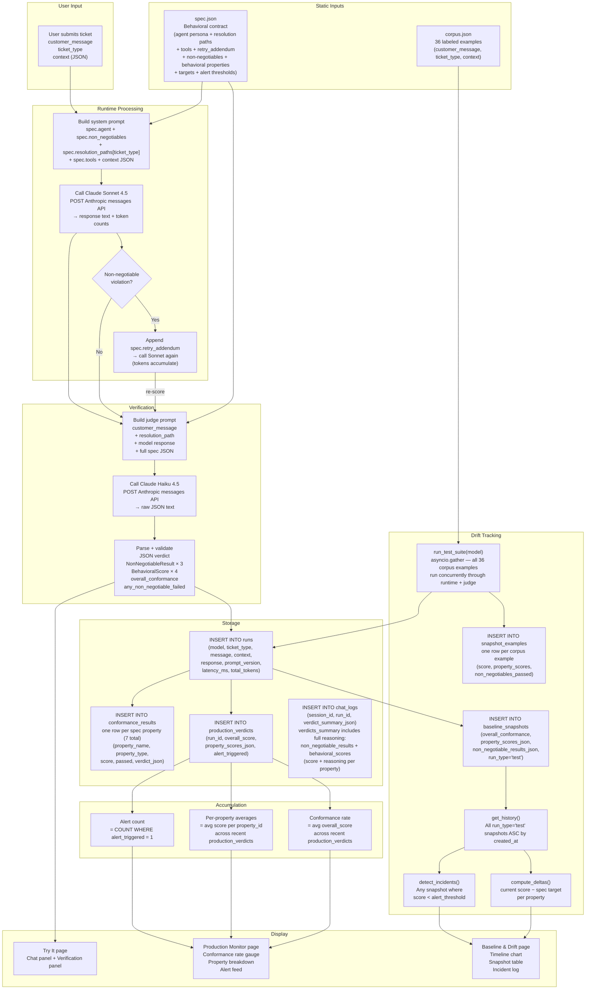

# GlassBox Data Flow

This document traces how data moves through GlassBox from the moment a user submits a ticket to the point where the result is stored and displayed. It also covers how static inputs (spec, corpus) relate to dynamic run data, and how individual verdicts accumulate into the conformance metrics shown across the UI.

---

## Full Data Lifecycle

---

## Static Inputs vs Dynamic Run Data

**`spec.json`** is the behavioral contract and the sole configuration file for domain-specific content. It is read from disk on first use and cached in memory. It defines:

- **Agent persona** — role description, task, and conversation style bullets injected into the system prompt.
- **Resolution paths** — per-ticket-type step-by-step agent instructions, keyed by `ticket_type`.
- **Tools** — the list of available tool names, signatures, and descriptions shown in the system prompt.
- **Retry addendum** — the correction instruction appended to the system prompt when a non-negotiable violation is detected.
- **Non-negotiables** — which properties are binary/zero-tolerance.
- **Behavioral properties** — which properties are scored 0–1, with targets and alert thresholds.

Because all domain-specific content lives in `spec.json`, adapting GlassBox to a new domain requires only replacing `spec.json` and `corpus.json` — no Python changes are needed in `runtime.py` or `judge.py`.

**`corpus.json`** is the test fixture set — 36 labeled customer support scenarios. It is only read when a test suite run is triggered (drift detection or model comparison). Each example provides `customer_message`, `ticket_type`, and `context`. The corpus is static; it does not grow as new live tickets come in.

**Run data** is fully dynamic. Every ticket submitted via the Try It page (or via a test suite run) creates a row in `runs`, one row per spec property in `conformance_results`, and one row in `production_verdicts`. This data accumulates indefinitely and drives the Monitor and Drift pages.

---

## How Verdicts Accumulate into Conformance Rates

Each call to `runtime.handle_ticket()` produces one `production_verdicts` row. The monitor endpoint reads the most recent 50 verdicts and computes:

- **Overall conformance rate**: mean of `overall_score` across all 50 rows.
- **Per-property breakdown**: for each `property_id` key in `property_scores_json`, compute the mean across all 50 rows.
- **Alert count**: count of rows where `alert_triggered = 1`.

An `alert_triggered` flag is set to `1` when either:
- Any behavioral property score falls below its `alert_threshold` from `spec.json`, or
- Any non-negotiable result returned `passed = false` from the judge.

---

## How Snapshots Version Behavior Over Time

A `baseline_snapshot` is a point-in-time summary produced by running the entire 36-example corpus through the runtime and judge and averaging the scores. Each snapshot records:

- The model used.
- `prompt_version` and `corpus_version` — so changes to the prompt or corpus can be tracked independently of model changes.
- `overall_conformance` — mean of all four behavioral property averages.
- `property_scores_json` — per-property averages across all 36 runs.
- `non_negotiable_results_json` — pass rate (not just pass/fail) per non-negotiable, since it's the aggregate of 36 individual verdicts.
- `run_type` — `"baseline"` for Drift page snapshots, `"test"` for Test Suite snapshots, `"compare"` for Model Comparison snapshots. Each page reads and writes only its own run_type.

Each snapshot also stores per-example results in `snapshot_examples` — one row per corpus example with individual scores and a pass/fail flag. This enables example-level diff computation: when two consecutive baseline snapshots exist, `compute_example_diff()` identifies which specific examples newly failed, newly recovered, degraded, or improved between runs.

The **baseline** in GlassBox is a static, spec-defined target — not a historical snapshot. Each behavioral property has a `target` in `spec.json` (e.g., `resolution_matching` targets 0.90). The Baseline & Drift page computes deltas as `current_score − spec_target`:

- A positive delta means the model is exceeding the target.
- A negative delta means the model is below target — regardless of past performance.

This approach treats the spec as the grade threshold. There is no "first run" baseline to drift away from — the target is the anchor.

- `detect_incidents()` scans every snapshot in history and flags any property that fell below its `alert_threshold` — not just the latest snapshot.

Targets and alert thresholds are editable per-property via `PATCH /api/v1/spec/thresholds` (UI: the edit button on the Passing Thresholds card on the Drift page). Changes write to `spec.json` and take effect immediately.

On first startup with an empty database, `seed_synthetic_history()` inserts 14 pre-scripted snapshots dated back 14 days — but only when `SEED_SYNTHETIC_HISTORY=true` is set in `.env`. Day 8 in the synthetic data deliberately shows a `resolution_matching` drop to `0.74` (below the `0.80` threshold), providing a realistic incident for the UI to display out of the box.
---

## run_type Separation

All snapshot data shares the `baseline_snapshots` table but is segregated by a `run_type` column:

| run_type | Written by | Read by | Purpose |
|---|---|---|---|
| `test` | Model Evaluation page — "Run Test Suite" | Test Suite page + Baseline & Drift page | All regression runs; Drift page reads these and computes delta vs spec target |
| `compare` | Model Comparison page — "Run Comparison" | Comparison page | Side-by-side snapshots for two models, not part of drift history |

The `baseline` run_type is no longer used. Both the Model Evaluation and Baseline & Drift pages read from `run_type=test` snapshots. The Drift page has no "Run Now" button — runs are triggered exclusively from the Model Evaluation page.

This separation means a test suite run does not pollute the drift history, and a model comparison does not appear in the test suite results.
