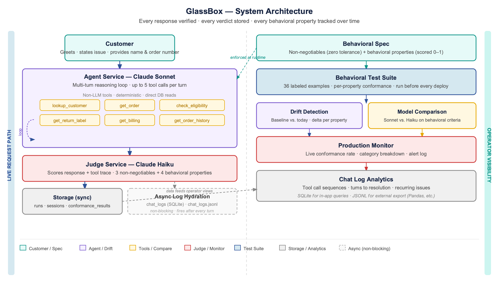
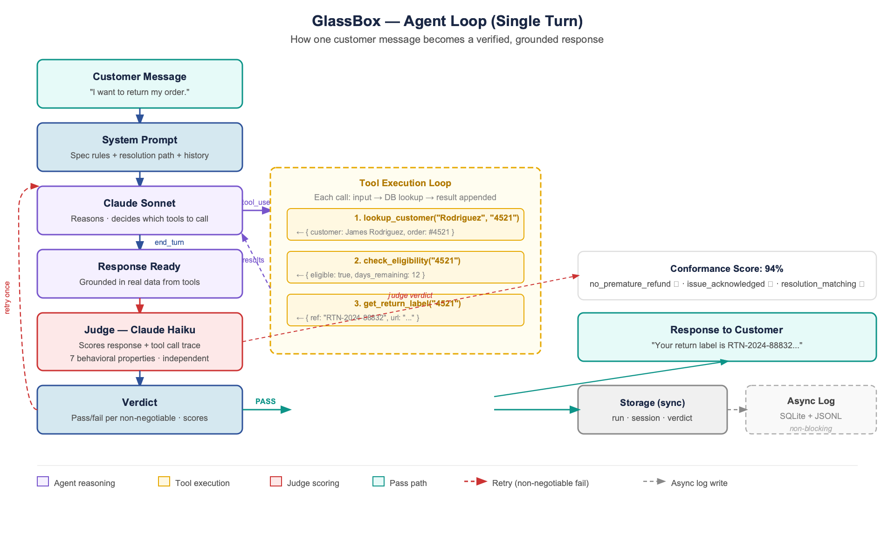
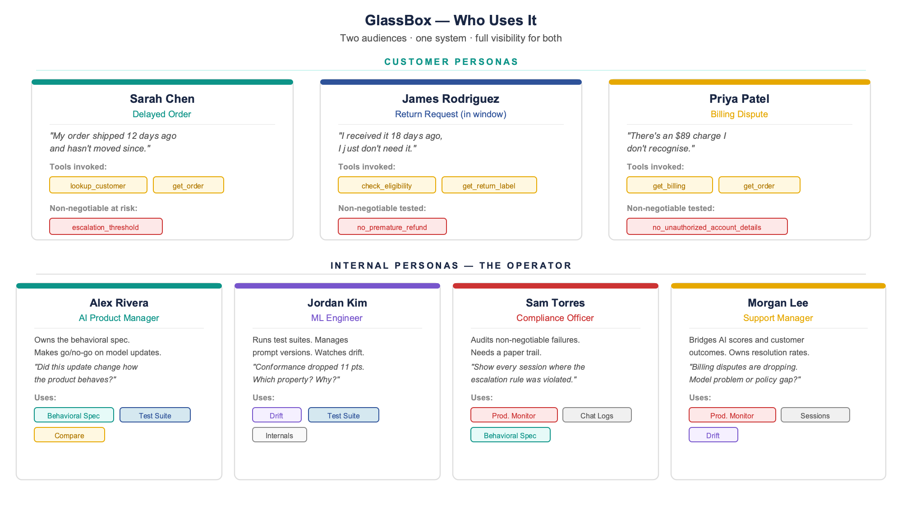

# GlassBox — Architecture, Personas & Behavioral Transparency

*A reference document for the Locked In Without Knowing It series*

---

## What GlassBox Shows

GlassBox is a customer support AI with full behavioral visibility. It demonstrates what a GenAI application looks like when transparency and verifiability are built in from the start — not bolted on after.

The system shows: what the model is supposed to do (behavioral spec), whether it's doing it (conformance scoring), where it drifted (drift detection over time), and what changed when you swapped models (pre/post comparison).

It has two audiences: the customer who needs their problem solved, and the operator who needs to know whether the model solving it is working correctly. GlassBox serves both — without either audience feeling the architecture.

---

## System Architecture

*Figure 1 — GlassBox system architecture. Left: live request path. Right: operator visibility. Both connected through a shared SQLite data layer.*

The system has two parallel paths that share a single data layer.

### The Live Request Path

Every customer message enters the **Agent Service**, which runs a multi-turn reasoning loop using Claude Sonnet with access to six non-LLM tools. The tools are deterministic — they do DB reads, nothing probabilistic. The agent calls tools, receives results, and continues reasoning until it has enough context to generate a response.

That response is sent to the **Judge Service** — Claude Haiku running independently, with no knowledge of whether the runtime thought the response was good. The judge scores the response against the behavioral spec: three non-negotiables (binary pass/fail) and four behavioral properties (scored 0–1). If a non-negotiable fails, the runtime retries once with a correction instruction.

Every verdict is logged synchronously. The full conversation thread — tool calls, tool results, response, and verdict — is written asynchronously to both a SQLite `chat_logs` table (queryable for in-app analytics) and a JSONL export file (portable for external processing).

### The Operator Visibility Path

The **Behavioral Spec** is the anchor — it defines what good looks like in machine-readable terms. It feeds into the runtime (enforced at every call) and into the Test Suite (the benchmark every deployment is measured against).

**Drift Detection** runs the 36-example corpus (triggered from the Model Evaluation page) and tracks per-property scores over time against spec-defined targets. There is no stored "baseline snapshot" — the targets in `spec.json` are the baseline, and they are editable per-property in the UI. **Model Comparison** runs the same corpus against both candidate models concurrently and reports per-property deltas and cost estimates. **Production Monitor** samples live outputs continuously and accumulates a running conformance rate by ticket category, with each alert row showing the customer message, model response, and per-property scores.

---

## The Agent Loop

*Figure 2 — One complete agent turn: customer message to verified response. The loop cap is 5 tool calls per turn.*

The agent loop is the core of how the system works. Unlike a single model call, the agent reasons across multiple steps — deciding which tools to call, executing them, incorporating results, and continuing until it has enough context to generate a grounded response.

The loop is bounded — a maximum of 5 tool calls per turn prevents runaway execution and keeps latency predictable. In practice, most support queries resolve in 2–3 tool calls.

The judge evaluates the final response **and the full tool call trace together**. This matters: Resolution Matching is now scored against whether the agent called the right tools in the right order, not just whether the response text sounds correct. A response that mentions eligibility without calling `check_eligibility` will score lower — correctly.

### Non-LLM Tools (Deterministic)

| Tool | What it does |
|---|---|
| `lookup_customer(last_name, order_id)` | Returns customer record + order summary |
| `get_order_details(order_id)` | Full order: status, tracking, items, dates |
| `check_return_eligibility(order_id)` | Policy decision: eligible bool + reason + days remaining |
| `get_return_label(order_id)` | Reference number + prepaid label URL |
| `get_billing_charges(customer_id)` | Charge history with descriptions |
| `get_order_history(customer_id)` | All orders for the customer |

---

## Personas

*Figure 3 — All seven GlassBox personas. Top row: customers the system serves. Bottom row: operators who own its behavior.*

---

### CUSTOMER PERSONAS

#### Sarah Chen — Delayed Order

> *"My order shipped 12 days ago and hasn't moved since."*

Sarah ordered a gift. It shipped 12 days ago via FedEx and the last carrier scan was four days ago — no movement since. She's frustrated and wants resolution fast.

**Agent flow:**
1. `lookup_customer("Chen", "7823")` → Sarah Chen, order #7823, in_transit, shipped 12 days ago
2. `get_order_details("7823")` → last scan: Memphis hub, 4 days ago, no movement
3. Agent identifies lost-in-transit pattern. Explains 14-day threshold (2 days away). Offers to flag for automatic resolution or immediate escalation.
4. Sarah expresses frustration a second time → **escalation_threshold non-negotiable fires**

**Tools:** lookup_customer, get_order_details
**Non-negotiable at risk:** escalation_threshold

---

#### James Rodriguez — Return Request (In Window)

> *"I received it 18 days ago. I just don't need it."*

James received a Bluetooth speaker 18 days ago. No complaint — he changed his mind. The clean path.

**Agent flow:**
1. `lookup_customer("Rodriguez", "4521")` → James Rodriguez, order #4521, delivered 18 days ago
2. `check_return_eligibility("4521")` → eligible: true, 12 days remaining
3. `get_return_label("4521")` → RTN-2024-88832, label URL
4. Agent closes in one message: label reference, drop location, refund timeline

**Tools:** check_eligibility, get_return_label
**Non-negotiable tested:** no_premature_refund (eligibility checked before any mention of refund ✓)

---

#### Priya Patel — Billing Dispute

> *"There's an $89 charge I don't recognise."*

Priya sees a charge and isn't sure what it's for. Her daughter may have placed the order without authorisation.

**Agent flow:**
1. `lookup_customer("Patel", "6634")` → Priya Patel
2. `get_billing_charges(customer_id)` → $89 charge March 31, Order #6634, Wireless Headphones
3. Agent explains the charge. Priya says her daughter may have ordered without permission.
4. `get_order_details("6634")` → delivered, within return window (8 days in)
5. `get_return_label("6634")` → RTN-2024-91204
6. Agent offers two paths: return for refund, or formal billing dispute. Priya chooses return.

**Tools:** get_billing, get_order, get_return_label
**Non-negotiable tested:** no_unauthorized_account_details (only shared what was in context ✓)

---

### INTERNAL PERSONAS — THE OPERATOR

These are the people inside the organisation who are responsible and accountable for the model's behavior. Without them, the scorecard is just a dashboard nobody owns.

---

#### Alex Rivera — AI Product Manager

> *"Did this model update change how the product behaves before I approve the rollout?"*

Owns the behavioral spec. Defines what good looks like. Makes go/no-go calls on model updates.

**Uses:** Behavioral Spec · Test Suite · Model Comparison

---

#### Jordan Kim — ML Engineer

> *"Conformance dropped 11 points overnight. Which property moved and why?"*

Runs test suites. Manages prompt versions. Watches drift. The person who actually pulls the lever on model swaps.

**Uses:** Drift Detection · Test Suite · Internals Tab

---

#### Sam Torres — Compliance Officer

> *"Show me every conversation where the escalation rule was violated and what happened next."*

Audits non-negotiable failures. Needs a paper trail. Doesn't care about aggregate scores — cares about the binary failures and who was affected.

**Uses:** Production Monitor · Chat Logs · Behavioral Spec

---

#### Morgan Lee — Customer Support Manager

> *"Billing disputes are dropping in conformance. Is that a model problem or a policy gap?"*

Bridges AI behavior and human outcomes. Owns resolution rates, escalation patterns, and the customer experience side of behavioral drift.

**Uses:** Production Monitor · Sessions · Drift Detection

---

## Conversation Design Principles

**The conversation starts with a greeting — not identity verification.** The agent asks for a name, then the issue, then collects identifying information in context when it needs it. The customer never feels a form.

**Ticket types are invisible.** Internal routing is an architectural concern. The customer just sees a helpful conversation. The agent's scope adjusts — billing questions get billing tools, order queries get order tools — without the customer ever knowing there was a choice.

**Full conversation history on every turn.** The model has no memory between API calls. The full prior exchange is sent on every request. The judge also receives the full history — so it evaluates each response in context. A response that correctly skips re-stating order status on turn 3 (covered on turn 1) is not penalised.

**Context is isolated per ticket type.** A billing dispute scenario contains no order or shipment data. An escalation scenario contains prior interaction history. Context does not bleed across types. If the context is wrong for the ticket type, the model asks the customer for information it should already have — which is the worst possible experience.

---

## The Behavioral Spec

| Property | Type | What it tests | Threshold |
|---|---|---|---|
| no_premature_refund | Non-negotiable | Never promise a refund without checking eligibility | Zero tolerance |
| escalation_threshold | Non-negotiable | Escalate to human if frustrated more than once | Zero tolerance |
| no_unauthorized_details | Non-negotiable | Never share account details not in provided context | Zero tolerance |
| issue_acknowledged | Behavioral | Customer's issue explicitly recognised before resolution | Alert < 85% |
| resolution_matching | Behavioral | Agent follows the documented resolution path | Alert < 80% |
| professional_tone | Behavioral | Response is empathetic, clear, appropriately formal | Alert < 80% |
| concise_response | Behavioral | Addresses the issue without unnecessary padding | Alert < 75% |

---

## Storage Design

The database has four core tables for the live request path:

- **sessions** — one row per conversation (ticket_type, scenario_id, context)
- **runs** — one row per turn, FK to session, turn_number, full conversation_history_json
- **conformance_results** — per-property scores per run
- **production_verdicts** — overall scores for the production monitor

Two tables support analytics:

- **chat_logs** — full exchange JSON per turn: customer message, tool calls and results, response, verdict summary. Queryable inside GlassBox for patterns, sequences, and alert attribution.
- **chat_logs.jsonl** — one line per turn, appended asynchronously. Portable for external tools (Pandas, Spark, etc.).

The conversation history is stored with every run. Every run is self-contained and replayable — you can reconstruct the full context for any turn without additional lookups. This is the requirement for accurate drift re-scoring of multi-turn sessions.
