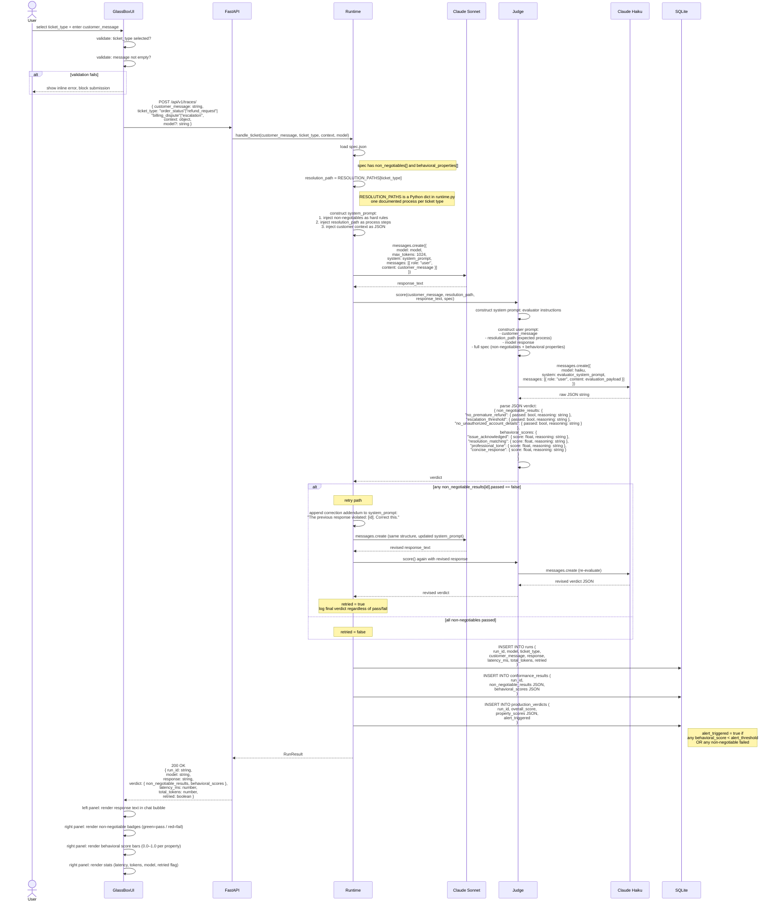
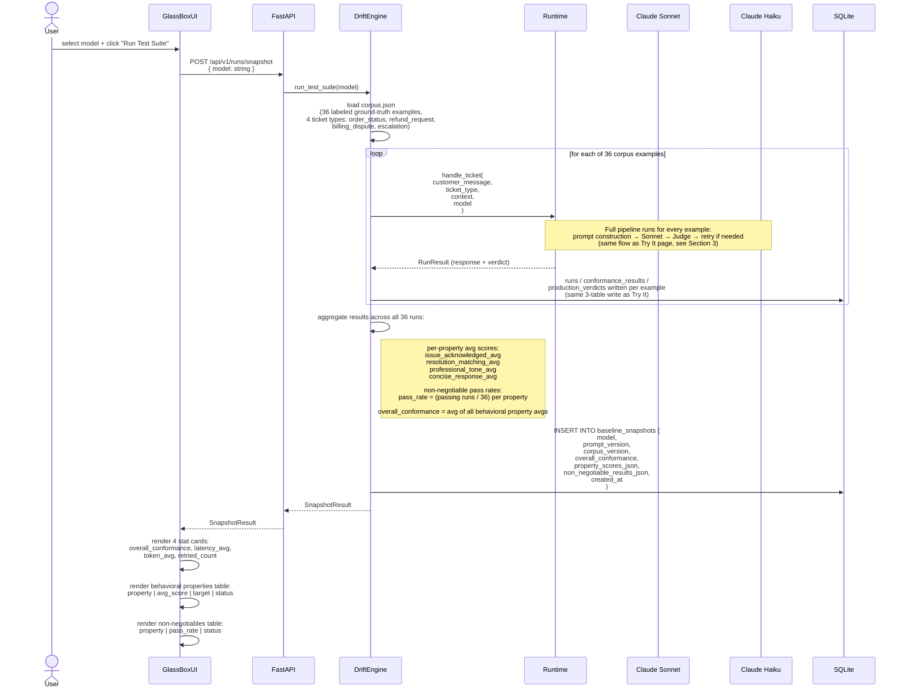
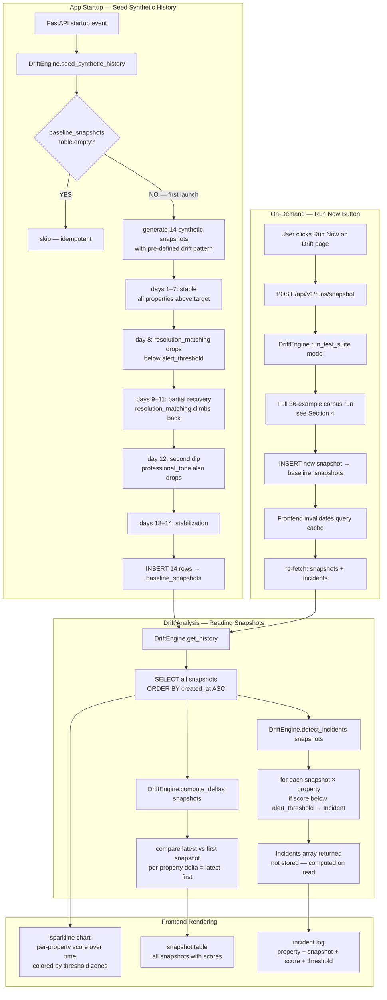
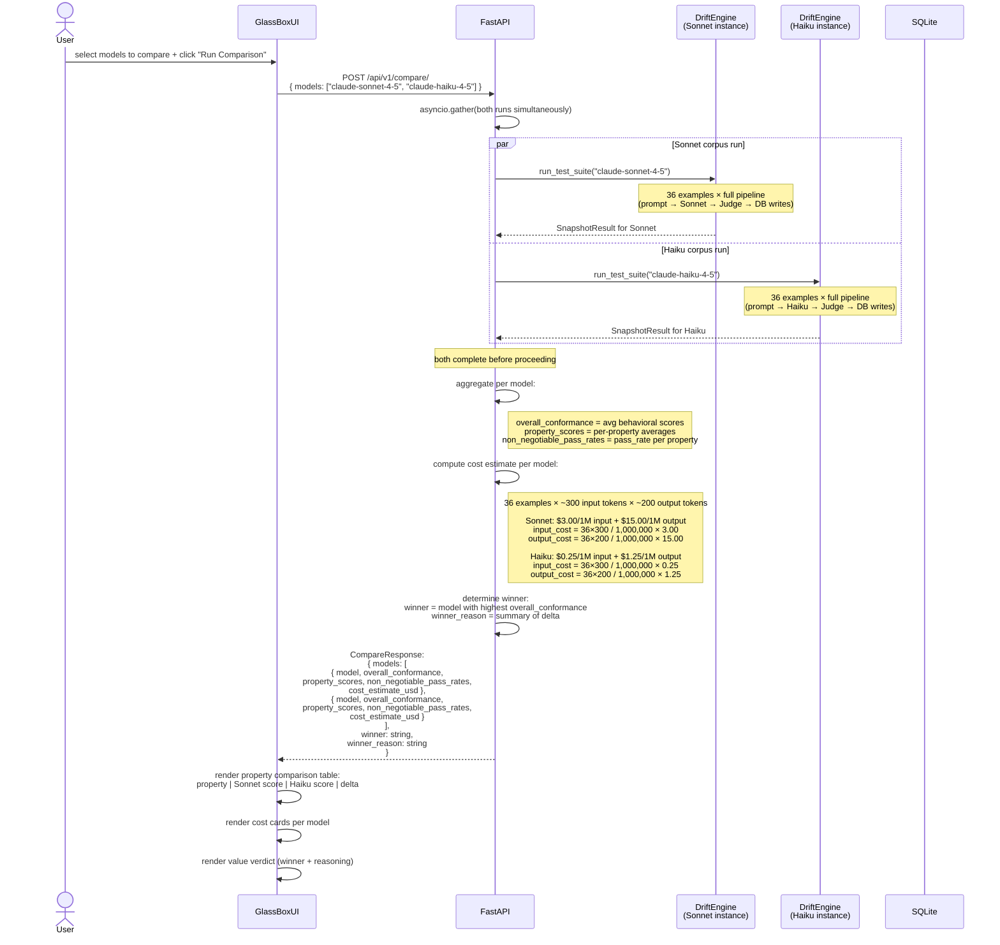
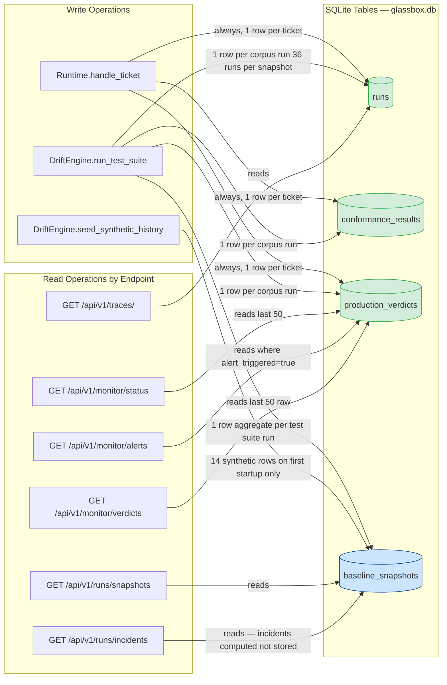

# GlassBox — Interaction Diagrams

> All diagrams render on GitHub. For local preview use a Mermaid-compatible viewer (e.g. the VS Code Mermaid extension, mermaid.live, or any tool supporting Mermaid v10+).

This document is the authoritative reference for how every component of GlassBox connects. Read it top-to-bottom for a complete mental model, or jump to a specific section when debugging a specific flow.

---

## Table of Contents

1. [Master Interaction Overview](#1-master-interaction-overview)
2. [Behavioral Spec → Runtime → Judge Pipeline](#2-behavioral-spec--runtime--judge-pipeline)
3. [Try It — Full Request/Response Cycle](#3-try-it--full-requestresponse-cycle)
4. [Test Suite → Baseline Snapshot](#4-test-suite--baseline-snapshot)
5. [Drift Detection — Scheduled vs On-Demand](#5-drift-detection--scheduled-vs-on-demand)
6. [Model Comparison — Parallel Execution](#6-model-comparison--parallel-execution)
7. [Production Monitor — Continuous Accumulation](#7-production-monitor--continuous-accumulation)
8. [Database Write Map](#8-database-write-map)
9. [How the Behavioral Spec is Defined](#9-how-the-behavioral-spec-is-defined)

---

## 1. Master Interaction Overview

The full system lifecycle from startup through a complete ticket submission, evaluation, retry, and persistence. Every actor in the system appears here.

```mermaid
sequenceDiagram
    actor User
    participant UI as GlassBoxUI<br/>(React/Vite :5173)
    participant API as FastAPI<br/>(:8888)
    participant RT as Runtime
    participant Sonnet as Sonnet<br/>(Claude Sonnet)
    participant Judge as Judge<br/>(Claude Haiku)
    participant DB as SQLite<br/>(glassbox.db)
    participant DE as DriftEngine

    rect rgb(240, 248, 255)
        Note over API, DB: App Startup
        API->>DB: db.init_db()
        DB-->>API: tables created (runs, conformance_results,<br/>production_verdicts, baseline_snapshots)
        API->>DE: DriftEngine.seed_synthetic_history()
        DE->>DB: SELECT COUNT(*) FROM baseline_snapshots
        DB-->>DE: count
        alt no snapshots exist
            DE->>DB: INSERT 14 synthetic snapshots<br/>(days 1–14 with pre-defined drift pattern)
        else snapshots already seeded
            DE-->>API: skip (idempotent)
        end
    end

    rect rgb(255, 248, 240)
        Note over User, DB: Ticket Submission (Try It page)
        User->>UI: fill in customer message + ticket type
        UI->>API: POST /api/v1/traces/<br/>{ customer_message, ticket_type, context, model? }
        API->>RT: handle_ticket(customer_message, ticket_type, context, model)

        RT->>RT: load spec.json
        RT->>RT: get RESOLUTION_PATHS[ticket_type]
        RT->>RT: construct system prompt<br/>(non-negotiables as rules +<br/>resolution path + customer context)

        RT->>Sonnet: messages.create(<br/>model=sonnet, max_tokens=1024,<br/>system=system_prompt, user=customer_message)
        Sonnet-->>RT: response text

        RT->>Judge: Judge.score(customer_message,<br/>resolution_path, response, spec)
        Judge->>Judge: construct evaluator system prompt<br/>+ user prompt (ticket + resolution + response + spec)
        Judge->>Haiku: messages.create(<br/>model=haiku, system=evaluator_prompt,<br/>user=evaluation_payload)
        Haiku-->>Judge: JSON verdict
        Judge-->>RT: { non_negotiable_results: {id: {passed, reasoning}},<br/>behavioral_scores: {id: {score, reasoning}} }

        alt any non_negotiable passed == false
            RT->>RT: append correction addendum to system prompt
            RT->>Sonnet: messages.create (retry with addendum)
            Sonnet-->>RT: revised response
            RT->>Judge: Judge.score() again
            Judge->>Haiku: messages.create (re-evaluate)
            Haiku-->>Judge: revised JSON verdict
            Judge-->>RT: revised verdict
        end

        RT->>DB: INSERT INTO runs<br/>(run_id, model, ticket_type, customer_message,<br/>response, latency_ms, total_tokens, retried)
        RT->>DB: INSERT INTO conformance_results<br/>(run_id, non_negotiable_results,<br/>behavioral_scores)
        RT->>DB: INSERT INTO production_verdicts<br/>(run_id, overall_score, property_scores,<br/>alert_triggered)
        RT-->>API: RunResult
        API-->>UI: { run_id, model, response, verdict,<br/>latency_ms, total_tokens, retried }
        UI->>UI: render response in left chat panel
        UI->>UI: render non-negotiable badges +<br/>behavioral score bars in right verification panel
    end
```



---

## 2. Behavioral Spec → Runtime → Judge Pipeline

The spec.json is loaded by two separate services for two separate purposes. The Runtime uses it to enforce behavior at prompt-construction time. The Judge uses it to independently evaluate the final response. These tracks are intentionally decoupled — the Runtime cannot "grade its own homework."

```mermaid
graph LR
    SPEC[spec.json]

    subgraph NN[Non-Negotiables]
        NN1[no_premature_refund]
        NN2[escalation_threshold]
        NN3[no_unauthorized_account_details]
    end

    subgraph BP[Behavioral Properties]
        BP1[issue_acknowledged target=0.95 alert=0.85]
        BP2[resolution_matching target=0.90 alert=0.80]
        BP3[professional_tone target=0.90 alert=0.80]
        BP4[concise_response target=0.85 alert=0.75]
    end

    subgraph AT[Alert Thresholds]
        AT1[per-property floor values]
    end

    SPEC --> NN
    SPEC --> BP
    SPEC --> AT

    subgraph RT_TRACK[Runtime Track — Prompt Enforcement]
        RT[Runtime]
        PROMPT[System Prompt Construction<br/>non-negotiables injected as hard rules<br/>resolution path injected as process guide]
        SONNET[Claude Sonnet<br/>generates customer response]
        RT --> PROMPT --> SONNET
    end

    subgraph JT[Judge Track — Post-hoc Scoring]
        JDG[Judge Service]
        EVAL[Evaluator Prompt<br/>ticket + resolution + response + spec]
        HAIKU[Claude Haiku<br/>returns structured JSON verdict]
        JDG --> EVAL --> HAIKU
    end

    NN --> RT
    BP --> JDG

    subgraph DE_TRACK[DriftEngine Track — Incident Detection]
        DE[DriftEngine]
        SNAP[baseline_snapshots<br/>per-property avg scores]
        INC[Incidents<br/>score below alert_threshold]
        DE --> SNAP --> INC
    end

    AT --> DE
    HAIKU -->|verdict feeds back| RT
    SNAP --> DB[(SQLite)]
    INC --> DB

    Note1["Runtime track: tries to make the model comply<br/>Judge track: independently verifies whether it did<br/>These are separate — no shared state during evaluation"]
    style Note1 fill:#fffbe6,stroke:#f0c040
```



---

## 3. Try It — Full Request/Response Cycle

Every step in a single ticket submission, including frontend validation, full prompt construction detail, retry logic, all three database writes, and the exact response shape returned to the UI.



---

## 4. Test Suite → Baseline Snapshot

The Test Suite page runs all 36 corpus examples through the full pipeline and saves an aggregate snapshot. This is how drift is tracked over time.



---

## 5. Drift Detection — Scheduled vs On-Demand

Drift is detected by comparing snapshots over time. The synthetic history seeds a baseline so the UI has something to show immediately on first launch.



---

## 6. Model Comparison — Parallel Execution

Model comparison runs two full test suite passes simultaneously and produces a head-to-head analysis with cost estimates.



---

## 7. Production Monitor — Continuous Accumulation

The monitor page builds up a live picture from every ticket submitted through Try It. It auto-refreshes every 10 seconds so operators see near-real-time conformance health.

```mermaid
graph TD
    subgraph WRITE[Data Accumulation]
        W1[Every ticket submitted via Try It]
        W2[Runtime inserts production_verdict]
        W3[production_verdicts table row:<br/>run_id, overall_score,<br/>property_scores JSON,<br/>alert_triggered boolean]
        W4{alert_triggered = true if...}
        W5[any behavioral_score below alert_threshold]
        W6[any non-negotiable failed]

        W1 --> W2 --> W3
        W3 --> W4
        W4 --> W5
        W4 --> W6
    end

    subgraph POLL[Frontend Auto-Poll every 10s]
        P1[useQuery with refetchInterval: 10000]
        P2[GET /api/v1/monitor/status]
        P3[GET /api/v1/monitor/alerts]
        P4[GET /api/v1/monitor/verdicts]
        P1 --> P2
        P1 --> P3
        P1 --> P4
    end

    subgraph AGGREGATE[Server-side Aggregation last 50 verdicts]
        A1[/api/v1/monitor/status]
        A2[SELECT last 50 FROM production_verdicts<br/>ORDER BY created_at DESC]
        A3[overall_conformance_rate = AVG of overall_scores]
        A4[category_breakdown = per-property avg scores]
        A5[alert_count = COUNT WHERE alert_triggered = true]

        A1 --> A2
        A2 --> A3
        A2 --> A4
        A2 --> A5

        A6[/api/v1/monitor/alerts]
        A7[SELECT FROM production_verdicts<br/>WHERE alert_triggered = true]

        A8[/api/v1/monitor/verdicts]
        A9[SELECT last 50 FROM production_verdicts<br/>raw rows]
    end

    subgraph RENDER[Frontend Rendering]
        R1[metric cards:<br/>overall_conformance_rate,<br/>alert_count, total_runs]
        R2[category breakdown:<br/>per-property score bars]
        R3[alert log:<br/>run_id + which properties triggered]
        R4[verdict table:<br/>last 50 raw verdicts]
    end

    W3 --> A2
    W3 --> A7
    W3 --> A9
    A3 --> R1
    A4 --> R2
    A5 --> R1
    A7 --> R3
    A9 --> R4
```

---

## 8. Database Write Map

A complete reference for which operations write to which tables, and which endpoints read from which tables.



**Key observations:**

- `runs`, `conformance_results`, and `production_verdicts` are always written together as a trio — they share `run_id` as a foreign key.
- `baseline_snapshots` is written by two distinct paths: real test suite runs (DriftEngine) and synthetic seeding (startup). Real runs are distinguishable by `model` and `corpus_version` fields.
- Incidents are **never stored** — they are computed on-the-fly by `DriftEngine.detect_incidents()` from the snapshots table on every read.
- The monitor endpoints only ever read from `production_verdicts` — they do not touch the snapshots or runs tables.

---

## 9. How the Behavioral Spec is Defined

**Where it lives:** `spec.json` at the project root. It is loaded at runtime by both the Runtime service and the Judge service. It is **not stored in the database** — it is the static source of truth for the entire evaluation framework. Changing spec.json changes what counts as correct behavior for all future runs.

---

**Two types of requirements:**

**Non-negotiables** are binary and carry zero tolerance. There are three:

| ID | Rule |
|----|------|
| `no_premature_refund` | Never promise a refund without checking eligibility first |
| `escalation_threshold` | Escalate to a human agent if the customer expresses frustration more than once |
| `no_unauthorized_account_details` | Never share account information that was not provided in the context |

If the Judge (Claude Haiku) returns `passed: false` for **any** non-negotiable, the Runtime will retry exactly once. It appends a correction addendum to the system prompt identifying which rule was violated and re-sends to Sonnet. If the revised response still fails the same non-negotiable, the failure is logged and the (still-failing) response is returned to the user. There is no second retry.

**Behavioral properties** are scored 0.0–1.0 by the Judge. Each property has two thresholds:

| ID | Target | Alert Threshold | Meaning |
|----|--------|-----------------|---------|
| `issue_acknowledged` | 0.95 | 0.85 | The response explicitly acknowledges the customer's specific issue |
| `resolution_matching` | 0.90 | 0.80 | The resolution offered matches the documented resolution path for the ticket type |
| `professional_tone` | 0.90 | 0.80 | The response maintains a professional, empathetic tone throughout |
| `concise_response` | 0.85 | 0.75 | The response is appropriately concise — complete but not padded |

- **Target**: what "good" looks like when averaged across a corpus run. A property score below target is a quality signal but not an alert.
- **Alert threshold**: the floor. If any property's average score in a snapshot falls below its alert threshold, the DriftEngine raises an Incident for that property in that snapshot.

---

**How the Judge evaluates:**

The Judge (Claude Haiku) is completely independent from the Runtime (Claude Sonnet). It does not see the system prompt that was used to generate the response — it only sees:

1. The customer's original message
2. The documented resolution path for the ticket type (from `RESOLUTION_PATHS` in `runtime.py`)
3. The model's final response text
4. The full spec (non-negotiables + behavioral properties with their descriptions)

The Judge is instructed to return **only** a structured JSON verdict with a score or pass/fail determination and a `reasoning` string for each property. This independence is intentional: the Runtime tries to make the model comply with the spec; the Judge independently verifies whether it did. They cannot collude.

---

**Resolution paths:**

Defined in `backend/services/runtime.py` as a Python dict called `RESOLUTION_PATHS`. There is one documented resolution process per ticket type:

| Ticket Type | Documented Process |
|-------------|-------------------|
| `order_status` | Look up order, provide current status and ETA, offer proactive notification if delayed |
| `refund_request` | Verify purchase date and eligibility window, check policy, confirm or explain denial |
| `billing_dispute` | Pull billing record, identify discrepancy, escalate to billing team if unresolvable |
| `escalation` | Acknowledge frustration, attempt one resolution, escalate to human if unresolved or repeated |

The resolution path serves double duty: it is injected into the Sonnet system prompt so the model knows what process to follow, and it is also given to the Judge so the Judge can evaluate whether the response actually followed that process (the `resolution_matching` score).
